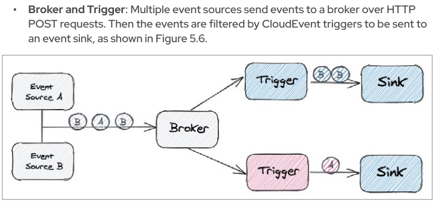

:toc:

The purpose of this is to showcase creating Quarkus based function from scratch, refactor it to receive/return `CloudEvent<Output>`,
build it with Quarkus docker or openshift S2I extensions and deploy it Knative Servce (KService), call it via direct HTTP Cloud Event
well create Knative `Trigger` on default Knative broker, to filter for the function name on the received cloud events which in turn again
would register the event on the deploy Quarkus based function.

* link:https://docs.openshift.com/serverless/1.28/functions/serverless-functions-getting-started.html[Functions & Knative Documentation]
* link:https://access.redhat.com/documentation/en-us/red_hat_openshift_serverless/1.28/html-single/eventing/index[Knative Eventing Documentation]
* link:https://opensource.com/article/21/7/cloudevents-bind-java-knative[Functions Tutorial by Daniel Oh]

## Create Function Project

       mvn io.quarkus:quarkus-maven-plugin:3.1.0.Final:create \
              -DprojectGroupId=org.acme       \
              -DprojectArtifactId=quarkus-serverless-cloudevent     \
              -Dextensions="funqy-knative-events"         \
              -DclassName="org.acme.getting.started.GreetingResource"  \

## Run Locally

    ./mvnw quarkus:dev

### Test Locally

    curl -v http://localhost:8080 \
    -H "Content-Type:application/json" \
    -H "Ce-Id:1" \
    -H "Ce-Source:cloud-event-example" \
    -H "Ce-Type:myCloudEventGreeting" \
    -H "Ce-Specversion:1.0" \
    -d "{\"name\": \"Daniel\"}"

    2023-06-05 11:44:24,207 INFO  [org.acm.get.sta.fun.clo.CloudEventGreeting] (executor-thread-1) Hello Daniel

## Refactored function method signature

* From

    @Funq
    public void myCloudEventGreeting(Person input) {
      log.info("Hello " + input.getName());
    }

* To

    @Funq
    public CloudEvent<Output> myCloudEventGreeting(CloudEvent<Person> input) {
        log.info(input);
        log.info("Hello " + input.data().getName());
        Output output = new Output(input.data().getName());
        return CloudEventBuilder.create().build(output);
    }

### Test Locally

    curl -v http://localhost:8080 \
    -H "Content-Type:application/json" \
    -H "Ce-Id:1" \
    -H "Ce-Source:cloud-event-example" \
    -H "Ce-Type:myCloudEventGreeting" \
    -H "Ce-Specversion:1.0" \
    -d "{\"name\": \"Danielson\"}"

* Log

    2023-06-05 11:51:25,033 INFO  [org.acm.get.sta.fun.clo.CloudEventGreeting] (executor-thread-1) CloudEvent{specVersion='1.0', id='1', type='myCloudEventGreeting', source='cloud-event-example', subject='null', time=null, extensions={}, dataSchema=null, dataContentType='application/json', data=org.acme.getting.started.funqy.cloudevent.Person@70a81e61}
    2023-06-05 11:51:25,034 INFO  [org.acm.get.sta.fun.clo.CloudEventGreeting] (executor-thread-1) Hello Danielson

* HTTP Response
+
----
    * Mark bundle as not supporting multiuse
    < HTTP/1.1 200 OK
    < ce-id: 21bdf796-f689-472f-a555-b5e14a288fc1
    < ce-specversion: 1.0
    < ce-source: myCloudEventGreeting
    < ce-type: myCloudEventGreeting.output
    < Content-Type: application/json
    < content-length: 23
    <
    * Connection #0 to host localhost left intact
    {"message":"Danielson"}
----

## Deploy the serverless event function to Knative

Prior to the following you must be logged in to the appropriate container registry via `docker login <registry url>`

###  Building a Container Image
Options for Building a Container Image (From *quarkus-for-spring-devs book*). See documentation: https://quarkus.io/guides/container-image#jib

[NOTE]
=====
These options don't include using the `kn` CLI with `func.yaml` (for such an example see `example-func-1`)
=====

1. Google JIB  -> Locally Build (Note 1) performed Using the link:https://quarkus.io/guides/container-image#jib[`container-image-jib`]
image-jib extension
2. Docker  -> Locally or Kubernetes build (Note 2) Using link:https://quarkus.io/guides/container-image#docker[`the container-image-docker`]
3. Openshift Source-To-Image (S2I) -> Openshift build (Note 2) Using the link:https://quarkus.io/guides/container-image#s2i[`container-image-s2i`]
3. Buildpacks [Locally or Kubernetes build (Note 2) using extension link:https://quarkus.io/guides/container-image#buildpack[`quarkus-container-image-buildpack`]

* Note 1: *_Locally_* means that the user can execute the build process on their laptop without using a
Kubernetes platform.
* Note 2: *_Kubernetes/OpenShift_* means that a component such as OpenShift S2I, Tekton, or Buildpacks
is added to the Kubernetes platform to perform the build.

### Building with Docker

* Add extension

    ./mvnw quarkus:add-extension -Dextensions="container-image-docker"

* Add to `application.properties` file the following variables to configure Knative and Kubernetes resources (make sure to replace yourAccountName with your container registry's account name, e.g., your username in Docker Hub):

    quarkus.container-image.build=true
    quarkus.container-image.push=true
    quarkus.container-image.builder=docker
    quarkus.container-image.image=quay.io/skoussou/funqy-quarkus-serverless-cloudevent-docker

* Containerize the function and then push it to the Docker Hub container registry automatically:

    ./mvnw clean package

###  Building with S2I

./mvnw quarkus:add-extension -Dextensions="container-image-s2i"

## Deploy & Test via HTTP Direct

* `oc -n functions-tests apply -f src/main/k8s/funqy-service.yaml`

----
echo '
apiVersion: serving.knative.dev/v1
kind: Service
metadata:
  name: funqy-quarkus-serverless-cloudevent-docker
spec:
  template:
    metadata:
      name: funqy-quarkus-serverless-cloudevent-docker-v2
      annotations:
        autoscaling.knative.dev/target: "1"
        autoscaling.knative.dev/scale-to-zero-pod-retention-period: "1m5s"
    spec:
      containers:
        - image: quay.io/skoussou/funqy-quarkus-serverless-cloudevent-docker' |oc apply -n functions-tests -f -
----

* Get KRoute object

    oc get rt
    NAME                                         URL                                                                                                                  READY   REASON
    examplefunc-1                                https://examplefunc-1-functions-tests.apps.cluster-x6fgr.x6fgr.sandbox241.opentlc.com                                True
    funqy-quarkus-serverless-cloudevent-docker   https://funqy-quarkus-serverless-cloudevent-docker-functions-tests.apps.cluster-x6fgr.x6fgr.sandbox241.opentlc.com   True

* Send a cloud event to the function over the HTTP protocol:

    curl -v https://funqy-quarkus-serverless-cloudevent-docker-functions-tests.apps.cluster-x6fgr.x6fgr.sandbox241.opentlc.com \
    -H "Content-Type:application/json" \
    -H "Ce-Id:1" \
    -H "Ce-Source:cloud-event-example" \
    -H "Ce-Type:myCloudEventGreeting" \
    -H "Ce-Specversion:1.0" \
    -d "{\"name\": \"Daniel\"}"

* Check logs of the Knative Service running the function

    oc get pods
    oc logs -f <pod name> -c user-container | grep CloudEventGreeting
   oc logs funqy-quarkus-serverless-cloudevent-docker-v1-deployment-644755 -c user-container | grep CloudEventGreeting

## Deploy & Test via Broker

Pattern: Event Source to Broker and Trigger

Deployment seems to be the same we just need to apply the following

* Broker resource

    kn broker create default

* Trigger on Attribute
----
echo "
apiVersion: eventing.knative.dev/v1
kind: Trigger
metadata:
  name: my-cloud-event-greeting-for-docker
spec:
  broker: default
  filter:
    attributes:
      type: myCloudEventGreeting  #(must match function method name as should Ce-Type)
  subscriber:
    ref:
      apiVersion: serving.knative.dev/v1
      kind: Service
      name: funqy-quarkus-serverless-cloudevent-docker" |oc apply -n functions-tests -f -
#   uri: /my-custom-path
----

* Send an event to the broker which will be picked up by `funqy-quarkus-serverless-cloudevent-docker`

[NOTE]
====
Broker URL (retrievable via `kn broker list` and `oc get broker default -o jsonpath='{.status.address.url}'`) is only in cluster available so we need to execute the command from inside the cluster POD.
Given a started `examplefunc-1` pod
====
    oc exec $(oc get pods -o=name |grep examplefunc-1|awk -F "/" '{print $2}') -- curl -v  \
    $(oc get broker default -o jsonpath='{.status.address.url}') \
    -H "Content-Type:application/json" \
    -H "Ce-Id:2" \
    -H "Ce-Source:cloud-event-example" \
    -H "Ce-Type:myCloudEventGreeting" \
    -H "Ce-Specversion:1.0" \
    -d "{\"name\": \"George Washington\"}"
