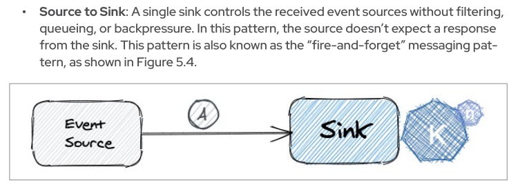

:toc:

The purpose of this is to showcase creation of a `@Funq` Quarkus based function utilizing the `kn func` clis to generate,
build with single step and multiple-step builds using the `kn func` cli, test the function locally, deploy it to container
registry and deploy it to OCP as `KService` and invoke via HTTP Cloudevent and finally apply to it the Knative `Source to Sink`
pattern utilizing `Kafka`, `KafkaUser`, `KafkaTopic`, `KnativeKafka` and `KafkaSource` resources to send cloud event to the function.

* link:https://docs.openshift.com/serverless/1.28/functions/serverless-functions-getting-started.html[Functions & Knative Documentation]
* link:https://access.redhat.com/documentation/en-us/red_hat_openshift_serverless/1.28/html-single/functions/index#serverless-functions-podman_serverless-functions-setup[Setup PODMAN for Functions]]
* link:https://access.redhat.com/documentation/en-us/red_hat_openshift_serverless/1.28/html-single/functions/index#serverless-developing-quarkus-functions[Developing Quarkus Functions]]
* link:https://access.redhat.com/documentation/en-us/red_hat_openshift_serverless/1.28/html-single/functions/index#serverless-functions-func-yaml_serverless-functions-yaml[Function project configuration in func.yaml]

## Option 1 - Locally in one step
### CREATE FUNC PROJECT

	kn func create -l quarkus -t cloudevents examplefunc-1

### Build, deploy (locally), RUN (locally)

	kn func run
		Function image built: image-registry.openshift-image-registry.svc:5000/default/examplefunc-1:latest

### TEST Locally
* In the folder where the FUNC exists execute

	kn func invoke  --data="Another call"	
		CloudEvent{specVersion='1.0', id='dade10cb-7818-443a-9fc5-181565b763ea', type='boson.fn', source='/boson/fn', subject='null', time=2023-06-02T13:54:37.773796884Z, extensions={}, dataSchema=null, dataContentType='application/json', data=Input{message='Another call'}}
	
* Or via CURL
** Establish port for func

	docker ps -a 
	83a24c4dc111   image-registry.openshift-image-registry.svc:5000/default/examplefunc-1:latest   "/cnb/process/web"   11 minutes ago   Up 11 minutes   127.0.0.1:43939->8080/tcp   brave_northcutt
	
** Via curl

	curl \
	-X POST -v "http://0.0.0.0:8081" \
	-H "content-type: application/json" \
	-H "ce-specversion: 1.0" \
	-H "ce-source: /boson/fn" \
	-H "ce-type: boson.fn" \
	-H "Ce-id: 123442-88ddd03432" \
	-d '{"input":"Function CURL Events"}'

	curl \
	-X POST -v "http://0.0.0.0:43939" \
	-H "content-type: application/json" \
	-H "ce-specversion: 1.0" \
	-H "ce-source: /boson/fn" \
	-H "ce-type: boson.fn" \
	-H "Ce-id: 123442-88ddd03432" \
	-d '{"input":"Function CURL Events"}'
	

## Option 2 - Locally in multiple step	

Creation has already been achieved (see Option 1)

### Build locally push to quay.io

	kn func build --registry quay.io/skoussou --push -v

### RUN (locally)

	kn func run --build=false -v

## Option 3 - Knative styles

Creation and Building already done

### Deploy in OCP

	kn func deploy --build=false -r quay.io/skoussou/examplefunc-1:latest -n functions-tests -v

### Test via ROUTE

	kn service list
	NAME            URL                                                                                     LATEST                AGE     CONDITIONS   READY   REASON
	examplefunc-1   https://examplefunc-1-functions-tests.apps.cluster-x6fgr.x6fgr.sandbox241.opentlc.com   examplefunc-1-00001   8m14s   3 OK / 3     True    

	kn route list
	NAME            URL                                                                                     READY
	examplefunc-1   https://examplefunc-1-functions-tests.apps.cluster-x6fgr.x6fgr.sandbox241.opentlc.com   True

	curl https://examplefunc-1-functions-tests.apps.cluster-x6fgr.x6fgr.sandbox241.opentlc.com \
	-H "content-type: application/json" \
	-H "ce-specversion: 1.0" \
	-H "ce-source: /boson/fn" \
	-H "ce-type: boson.fn" \
	-H "Ce-id: 123442-88ddd03432" \
	-d '{"input":"Function CURL Knative Events"}'

### Test via `KafkaSource` Sink

Pattern: Event Source to Sink

*_Prerequisites:_*

* Knative Operator Subscription
* Knative Serving
* Knative Eventing
* Deploy knative eventing link:./knative-setup-resources/eventing.yaml[eventing.yaml]
* Deploy `Kafka` link:./kafka-setup-resources/kafka.yaml[kafka.yaml]
* Deploy SASL `KafkaUser` link:./kafka-setup-resources/KafkaUser.yaml[KafkaUser.yaml]
* Deploy `KafkaTopic.yaml` (`functiontests`) link:./kafka-setup-resources/KafkaTopic.yaml[KafkaTopic.yaml]
* Deploy `KnativeKafka` resource (to make available `KafkaSource`) link:./knative-setup-resources/knativekafka.yaml[knativekafka.yaml]
* Deploy `KafkaSource` resource to sink to kservice `examplefunc-1`

	apiVersion: sources.knative.dev/v1beta1
	kind: KafkaSource
	metadata:
	  name: kafka-source
	spec:
	  consumerGroup: knative-group
	  bootstrapServers:
	    - cluster-serverless-kafka-bootstrap.kafkas.svc.cluster.local:9092
	  topics:
	    - functiontests
	  sink:
	    ref:
	      apiVersion: serving.knative.dev/v1
	      kind: Service
	      name: examplefunc-1

	apiVersion: sources.knative.dev/v1beta1
	kind: KafkaSource
	metadata:
	  name: kafka-source
	  namespace: knative-eventing
	  labels:
	    app: kafka-source
	    app.kubernetes.io/instance: kafka-source
	    app.kubernetes.io/component: kafka-source
	    app.kubernetes.io/name: kafka-source
	  annotations:
	    openshift.io/generated-by: OpenShiftWebConsole
	spec:
	  bootstrapServers:
	    - 'cluster-serverless-kafka-bootstrap.kafkas.svc.cluster.local:9092'
	  topics:
	    - functiontests
	  consumerGroup: knative-group
	  net:
	    sasl:
	      user: {}
	      password: {}
	    tls:
	      caCert: {}
	      cert: {}
	      key: {}
	  sink:
	    uri: ''

** verify KafkaSource in place

	oc get kafkasource -n functions-tests
	NAME           TOPICS              BOOTSTRAPSERVERS                                                       READY   REASON   AGE
	kafka-source   ["functiontests"]   ["cluster-serverless-kafka-bootstrap.kafkas.svc.cluster.local:9092"]   True             4m47s

** Produce a message in topic `functiontests` to be picked up by the KafkaSource

	oc -n kafkas run kafka-producer -ti --image=registry.redhat.io/amq7/amq-streams-kafka-33-rhel8:2.3.0 --rm=true --restart=Never -- bin/kafka-console-producer.sh --broker-list cluster-serverless-kafka-bootstrap.kafkas.svc.cluster.local:9092 --topic functiontests
	
	'{\"input\":\"Function CURL Knative Events 6\"}'

** Verify msg arrives in `KafkaTopic.yaml`

	oc -n kafkas run kafka-consumer -ti --image=registry.redhat.io/amq7/amq-streams-kafka-33-rhel8:2.3.0 --rm=true --restart=Never -- bin/kafka-console-consumer.sh --bootstrap-server  cluster-serverless-kafka-bootstrap.kafkas.svc.cluster.local:9092 --topic functiontests --from-beginning

** Verify message arrives/sinks in KSVC

	oc -n functiontests logs -f examplefunc-1-00001-deployment-64645fb96f-8m5 

It works BUT seems problematic to read the format of the message content input as cloud event?

	2023-06-05 09:44:27,847 ERROR [io.qua.ver.htt.run.QuarkusErrorHandler] (executor-thread-1) HTTP Request to / failed, error id: 4332b9cc-e122-4f3d-baa0-80f13fa34669-8: io.quarkus.funqy.runtime.ApplicationException: java.lang.RuntimeException: Don't know how to get event data (dataContentType: 'null', javaType: 'functions.Input').
		at io.quarkus.funqy.runtime.FunctionInvoker.invoke(FunctionInvoker.java:136)
		at io.quarkus.funqy.runtime.bindings.knative.events.VertxRequestHandler.dispatch(VertxRequestHandler.java:571)
		at io.quarkus.funqy.runtime.bindings.knative.events.VertxRequestHandler.lambda$processCloudEvent$4(VertxRequestHandler.java:404)
		at io.quarkus.vertx.core.runtime.VertxCoreRecorder$14.runWith(VertxCoreRecorder.java:576)
		at org.jboss.threads.EnhancedQueueExecutor$Task.run(EnhancedQueueExecutor.java:2449)
		at org.jboss.threads.EnhancedQueueExecutor$ThreadBody.run(EnhancedQueueExecutor.java:1478)
		at org.jboss.threads.DelegatingRunnable.run(DelegatingRunnable.java:29)
		at org.jboss.threads.ThreadLocalResettingRunnable.run(ThreadLocalResettingRunnable.java:29)
		at io.netty.util.concurrent.FastThreadLocalRunnable.run(FastThreadLocalRunnable.java:30)
		at java.base/java.lang.Thread.run(Thread.java:833)
	Caused by: java.lang.RuntimeException: Don't know how to get event data (dataContentType: 'null', javaType: 'functions.Input').
		at io.quarkus.funqy.runtime.bindings.knative.events.HeaderCloudEventImpl.data(HeaderCloudEventImpl.java:185)
		at io.quarkus.funqy.knative.events.AbstractCloudEvent.toString(AbstractCloudEvent.java:20)
		at java.base/java.lang.String.valueOf(String.java:4216)
		at java.base/java.io.PrintStream.println(PrintStream.java:1047)
		at functions.Function.function(Function.java:23)
		at java.base/jdk.internal.reflect.NativeMethodAccessorImpl.invoke0(Native Method)
		at java.base/jdk.internal.reflect.NativeMethodAccessorImpl.invoke(NativeMethodAccessorImpl.java:77)
		at java.base/jdk.internal.reflect.DelegatingMethodAccessorImpl.invoke(DelegatingMethodAccessorImpl.java:43)
		at java.base/java.lang.reflect.Method.invoke(Method.java:568)
		at io.quarkus.funqy.runtime.FunctionInvoker.invoke(FunctionInvoker.java:123)
		... 9 more
